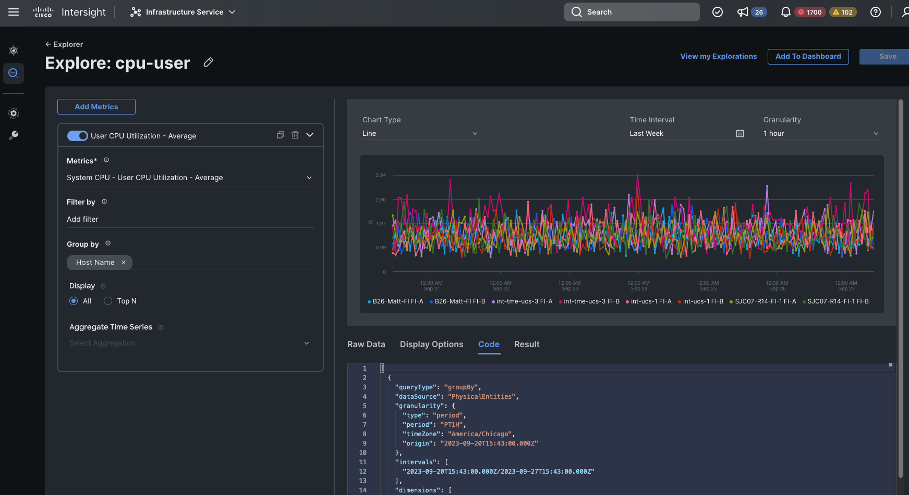

# Intersight Monitoring Examples

## Authorization

Authorization is performed by every Intersight cmdlet. You must properly configure the Intersight PowerShell module parameters using the `Set-IntersightConfiguration` cmdlet as described in the [Getting Started](https://github.com/CiscoDevNet/intersight-powershell/blob/master/GettingStarted.md) page of the Intersight module code.  Scripts in this directory use the ..\api-config.ps1 script to set the config.

## Examples

---

### `cpu-user-stats.ps1`

This script provides an example of using the telemetry/TimeSeries API to collect User CPU Utilization stats.  The query code is taken from Intersight's Explorer UI as shown in the lower right of the screenshot below 
