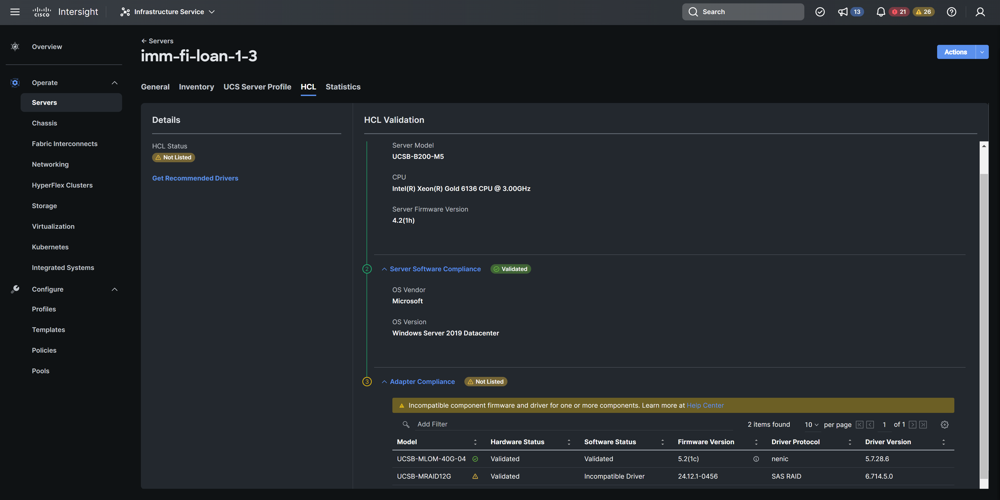

# OS Discovery Agent For Windows

## Description

**Community** supported alternative to Intersight OS Discovery Tool that can run on baremetal hosts and populate driver information in Intersight via IPMI.  This tool does **NOT** require any additional connectiivty or remote access unlike the original OS Disovery tool and behaves similar to ESXi ucs-tools.

_functions.ps1_ - Helper functions from original OS Discovery Tool used to gather local host inventory

_agent.ps1_  - Using functions.ps1 it creates host-inv.yaml file and writes it to the IMC via IPMI



## Table of Contents

- [Installation](#installation)
- [Usage](#usage)
- [Details](#details)
- [License](#license)
- [Limitations](#limitations)

## Installation
**System Requirements:**
Windows Server 2012+

Privileged account on host that can issue ipmiutil commands and retrieve local inventory


**Host Software Requirements:**

Powershell 7.2+

IPMIUtil 3.1.9+ (https://ipmiutil.sourceforge.net/)


## Usage

Confirm all pre-requisite packages are installed

With a privileged user account run "agent.ps1 c:\pathto\ipmiutil.exe" manually or setup a scheduled task to run the script at boot and preferably every 24 hours

Check Host HCL status in Intersight to see populate OS & driver info

## Details

Example host-inv.yaml structure:
```
annotations:
 -kv:
  key: os.updateTimestamp
  value: 2023-04-08T07:34:24.644Z
 -kv:
  key: os.vendor
  value: Microsoft
 -kv:
  key: os.name
  value: Windows
 -kv:
  key: os.arch
  value: 64-bit
 -kv:
  key: os.type
  value: Server
 -kv:
  key: os.kernelVersionString
  value: Windows Server 2019 Datacenter
 -kv:
  key: os.releaseVersionString
  value: Datacenter
 -kv:
  key: os.updateVersionString
  value: 
 -kv:
  key: os.driver.0.name
  value: nenic
 -kv:
  key: os.driver.0.description
  value: Cisco VIC Ethernet Interface
 -kv:
  key: os.driver.0.version
  value: 5.7.28.6
 -kv:
  key: os.driver.1.name
  value: SAS RAID
 -kv:
  key: os.driver.1.description
  value: AVAGO MegaRAID SAS Adapter
 -kv:
  key: os.driver.1.version
  value: 6.714.5.0
 -kv:
  key: os.driver.2.name
  value: ahci
 -kv:
  key: os.driver.2.description
  value: Standard SATA AHCI Controller
 -kv:
  key: os.driver.2.version
  value: 10.0.17763.168
```

IPMI Command Structure
```
Delete File - 0x36 0x77 0x03 [hex-filename]
  Example Delete host-inv.yaml - ipmiutil cmd -d 0x36 0x77 0x03 0x68 0x6f 0x73 0x74 0x2d 0x69 0x6e 0x76 0x2e 0x79 0x61 0x6d 0x6c

Open and Retrieve File Descriptor - 0x36 0x77 0x00 [hex-filename]
  Example Get host-inv.yaml file descriptor - ipmiutil cmd -d 0x36 0x77 0x00 0x68 0x6f 0x73 0x74 0x2d 0x69 0x6e 0x76 0x2e 0x79 0x61 0x6d 0x6c
  IPMI will return file descriptor eg 0x08
 
Write Data to File - 0x36 0x77 0x02 [hex-filedescriptor] [hex-payload length] [hex-litle endian starting point in file] [hex-payload]
  Example write 1's (0x31) and 2's (0x32) starting at byte 40 in the host-inv.yaml file - ipmiutil cmd -d 0x36 0x77 0x02 0x03 0x14 0x28 0x00 0x00 0x00 0x31 0x31 0x31 0x31 0x31 0x31 0x31 0x31 0x31 0x32 0x32 0x32 0x32 0x32 0x32 0x32 0x32 0x32 0x32 0x0A
  
Close File Descriptor - 0x36 0x77 0x01 [hex-filedescriptor]
  Example close file ipmiutil cmd -d 0x36 0x77 0x01 0x08
```

## License
```
<#
Copyright (c) 2021 Cisco and/or its affiliates.
This software is licensed to you under the terms of the Cisco Sample
Code License, Version 1.0 (the "License"). You may obtain a copy of the
License at
               https://developer.cisco.com/docs/licenses
All use of the material herein must be in accordance with the terms of
the License. All rights not expressly granted by the License are
reserved. Unless required by applicable law or agreed to separately in
writing, software distributed under the License is distributed on an "AS
IS" BASIS, WITHOUT WARRANTIES OR CONDITIONS OF ANY KIND, either express
or implied.
#>
```
## Limitations

🛑 This is a COMMUNITY Supported Example (Eg. No TAC Support)
